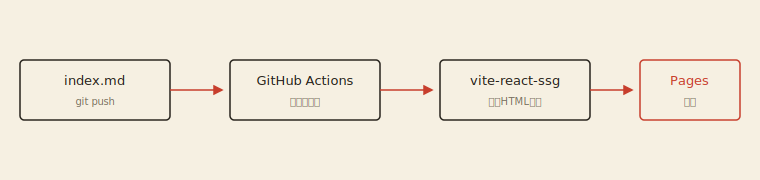

このブログは、CMSもデータベースも持たない。あるのはリポジトリと、`content/posts/` に並ぶマークダウンだけだ。記事を書いてpushすれば、あとはGitHub Actionsが静的HTMLを生成してGitHub Pagesへ届けてくれる。

## なぜ自作するのか

HugoやAstroを使えば一晩で済む。それでも自作したのは、ブログそのものを実験場にしたかったからだ。

- 記事の管理ルールを自分の執筆スタイルに完全に合わせられる
- ビルドパイプラインの中身を全部把握できる
- 「気に入らない部分を直せない」ストレスから解放される

## アーキテクチャ

構成は素朴で、ビルド時にすべてを終わらせる。ブラウザに届く頃には、記事はただのHTMLになっている。



記事は「1記事1フォルダ」で管理する。画像も同じフォルダに置いて、相対パスで参照する。

```
content/posts/2026-07-14-launching-this-blog/
├── index.md      ← この記事
└── pipeline.svg  ← 上の図
```

## frontmatterはZodで検証する

ビルド時にfrontmatterをZodで検証して、必須項目が欠けた記事はビルドごと失敗させる。壊れた記事が公開されるより、公開されない方がずっといい。

```typescript
const frontmatterSchema = z.object({
  title: z.string().min(1, 'title は必須です'),
  date: z.union([z.date(), z.string().min(1)]),
  description: z.string().optional(),
  draft: z.boolean().optional().default(false),
})
```

`draft: true` を付けた記事は、一覧にも詳細ページにも現れない。書きかけの原稿を安心してpushできる。

## コードはビルド時に色付けする

シンタックスハイライトにはShikiを使った。VSCodeと同じエンジンなので発色が正確で、なによりビルド時に色付けが終わるからクライアントにJavaScriptを送らなくて済む。テーマはVitesseをライトとダークで使い分けている。

## これから

検索とダークモードの磨き込みが次の課題だ。記事が増えてきたら、このブログ自身の変化も記事にしていこうと思う。
