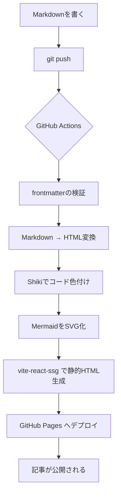

はじめまして。このブログの最初の記事は、このブログ自身について書くことにしました。

世の中にはブログサービスもSSGフレームワークも数えきれないほどあります。それでもあえてゼロから自作したのは、**「自分が一番書きやすい仕組み」を自分の手で作りたかった**から。この記事では、その技術スタックと、日々の執筆がどれだけシンプルになったかを紹介します。

## いちばん伝えたいこと：書くのはMarkdownを置くだけ

先に結論から。このブログで新しい記事を公開する手順は、これだけです。

1. 記事フォルダを作って `index.md` にMarkdownで本文を書く
2. `git push` する

以上です。ビルドもデプロイも、管理画面へのログインも要りません。pushした瞬間にGitHub Actionsが動き出し、数分後にはサイトへ反映されます。

```bash
# 新しい記事を書くときにやることの全て
mkdir content/posts/2026-07-20-my-new-post
vim content/posts/2026-07-20-my-new-post/index.md
git add . && git commit -m "docs: 新しい記事を追加" && git push
```

記事の実体は、フロントマター付きのただのMarkdownファイルです。

```markdown
---
title: 記事のタイトル
date: 2026-07-20
description: 一覧やSNSシェアに使われる説明文
---

## 見出し

ここに本文を書いていく。
```

CMSのデータベースも、独自の記法も、専用エディタもありません。使い慣れたエディタとGitだけで完結する——この一点にこだわって設計しました。

## 技術スタック

フロントエンドは素直な構成です。特別なフレームワークは使わず、Viteの上に薄く組み上げています。

| 領域 | 採用技術 |
| --- | --- |
| ビルドツール | Vite |
| UI | React + TypeScript |
| スタイリング | TailwindCSS |
| 静的サイト生成 | vite-react-ssg |
| Markdown変換 | unified（remark / rehype） |
| シンタックスハイライト | Shiki |
| 図表 | Mermaid（ビルド時にSVG化） |
| ホスティング | GitHub Pages |
| CI/CD | GitHub Actions |

ポイントは、**表示に必要な処理をできるだけビルド時に終わらせている**ことです。シンタックスハイライトも、後述するMermaidの図も、閲覧者のブラウザではなくビルドの段階でHTMLへ焼き込まれます。おかげでページに届くのはほぼ完成したHTMLだけになり、表示が速く保てます。

### コンポーネントはAtomicデザインで

UIコンポーネントはAtomicデザインパターン（atoms → molecules → organisms → templates → pages）で整理しています。個人ブログには大げさかもしれませんが、「ボタンひとつの見た目を変えたい」と思ったときに迷わず辿り着ける構造は、長く付き合うほど効いてきます。

## pushしてから公開されるまで

裏側では何が起きているのか。デプロイのフローを図にするとこうなります。



この図自体、`mermaid` と書いたコードブロックから生成されています。執筆時はMermaid記法を書くだけで、ビルド時にSVGへ変換されて埋め込まれる仕組みです。図を貼るためにわざわざ画像を書き出す必要はありません。

### 壊れた記事は公開させない

自動化で怖いのは「気づかないうちに壊れたものが公開される」こと。そこで、ビルド時にいくつかのチェックを入れています。

- フロントマターに必須項目（`title` / `date`）が無ければ**ビルドを失敗させる**
- 本文が参照している画像ファイルが存在しなければ**ビルドを失敗させる**
- Mermaidの記法が壊れていれば**ビルドを失敗させる**

ビルドが失敗すればデプロイは実行されないので、壊れた記事が世に出ることはありません。「pushするだけ」の手軽さと、公開物の品質を両立させるための安全弁です。

## こだわった機能

読む人・書く人それぞれの体験のために、いくつか手を入れています。

- **ダークモード** — OSの設定に追従しつつ、手動でも切り替え可能。選択は記憶されます
- **目次の自動生成** — 見出しから目次を組み立て、いま読んでいる位置をハイライト
- **下書き** — `draft: true` を付けた記事は公開ビルドから除外。書きかけでも安心してpushできます
- **レスポンシブ対応** — スマホでも読みやすいレイアウト

## これから

まずは「自分が書きたくなる場所」ができました。これから技術的に学んだことや、このブログ自体の改善も記録していく予定です。

ソースコードは [GitHub](https://github.com/kkito0726/tech-blog-kkito) で公開しています。同じように「自分だけのブログを作りたい」と思っている人の参考になれば嬉しいです。

それでは、これからよろしくお願いします。
