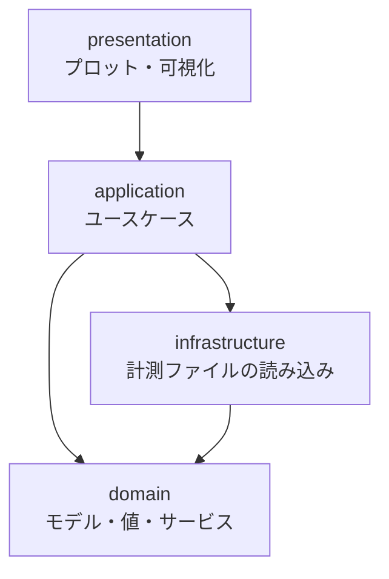

[pyMEA（MEA_modules）](https://github.com/kkito0726/MEA_modules) という、MEA計測データを解析するためのPythonライブラリを開発しています。この記事では、そもそもMEAとは何かという話から、ライブラリのアーキテクチャ、そして「プログラミングが初めての研究者でも使えること」を目指したドキュメントの取り組みまでを紹介します。

## MEAシステムとは

MEA（Multi Electrode Array / 多電極アレイ）は、**培養した細胞の電気活動を多数の電極で同時に記録する装置**です。

心筋細胞や神経細胞は、活動するときに細胞外へ微弱な電位変化を生みます。MEAはシャーレの底に電極を格子状に並べ、その電位を多点で同時に拾います。pyMEAが対象としているシステムでは64個の電極を使うため、**64チャネル分の時系列波形**が一度に得られます。

このデータから、たとえば次のような指標を読み取ります。

- **ISI（Inter Spike Interval）** — 拍動と拍動の間隔。心筋なら拍動リズムの指標になります
- **FPD（Field Potential Duration）** — 細胞外電位の継続時間。心電図でいうQT間隔に対応する指標として、薬剤の影響評価などに使われます
- **伝導速度** — 電極間の到達時間差と距離から、興奮が細胞シート上を伝わる速さを求めます

つまり「電極ごとの生波形」から「生物学的に意味のある数値」へ変換するのが解析の仕事で、その部分を担うのがpyMEAです。

## pyMEAで何ができるか

計測装置が吐き出すのは `.hed` / `.bio` という形式の生データです。これを読み込み、ピークを検出し、数値計算やグラフ描画を行うまでを短いコードで書けるようにしています。

```python
from pyMEA import *

hed_path = "/User/you/your_record_data.hed"
start, end = 0, 30
electrode_distance = 450

# 0〜30秒、電極間距離450µmとして読み込む
mea = read_MEA(hed_path, start, end, electrode_distance)

# 負のピーク（スパイク）を検出
peak_index = detect_peak_neg(mea.data)

# 拍動間隔（ISI）を計算
isi = mea.calculator.isi(peak_index, ch=2)
isi_mean = isi.mean

# 2電極間の伝導速度を計算
conduction_velocity = mea.calculator.conduction_velocity(peak_index, ch1=9, ch2=54)
```

`PyMEA` のインスタンスが、役割ごとのオブジェクトを束ねる形になっています。

| オブジェクト | 役割 |
| --- | --- |
| `data` (MEA) | 計測データの保持 |
| `fig` (FigMEA) | グラフ描画 |
| `calculator` (Calculator) | 数値計算 |
| `electrode` (Electrode) | 電極の位置情報 |

描画は64電極の一覧表示、単一電極の波形、ラスタープロット、2D/3Dカラーマップなどに対応しています。ノイズ除去も、心筋の強〜中信号用・微弱信号用・神経用といったプリセットを用意し、条件に応じて選ぶだけで済むようにしました。

## アーキテクチャ

pyMEAはレイヤードアーキテクチャで構成しています。



- **domain** — 解析の中核となるモデル・値オブジェクト・ドメインサービス
- **application** — ユースケースの実装
- **infrastructure** — `.hed` / `.bio` といった計測ファイルの読み込み
- **presentation** — グラフ描画・可視化

この分け方には理由があります。MEAの計測装置やファイル形式は、環境によって変わり得ます。一方で「ピークを検出する」「拍動間隔を求める」といった解析ロジックの本質は、ファイル形式が変わっても変わりません。**変わりやすいもの（入出力）と変わりにくいもの（解析ロジック）を分けておく**ことで、片方の変更がもう片方に波及しないようにしています。

## 設計思想：ユーザーの環境に踏み込みすぎない

このプロジェクトで一番悩んだのが、**データ変換ツール `mea2npz`** の扱いです。

`.hed` / `.bio` の生データはサイズが大きく、持ち運びや保管が大変です。そこで軽量な `.npz` 形式へ変換する仕組みが必要でした。最初はpyMEAの機能として実装すればいいと考えていましたが、ここで問題に気づきます。

**変換したいだけの人にPythonの環境構築を要求するのは重すぎる**、ということです。

データを圧縮して保存したいだけの共同研究者に、Pythonをインストールし、パッケージを入れ、コマンドを覚えてもらう——これは目的に対して負担が大きすぎます。

そこで `mea2npz` は**Goで書いた単一バイナリのCLIツール**として切り出しました。

- **Pythonのインストールが不要** — 実行ファイルを1つ置くだけで動く
- **Windows / Mac / Linux で動く** — Goのクロスコンパイルで各OS向けのバイナリを配布
- **出力はpyMEAと数値的に完全一致** — 変換後の `.npz` はpyMEAでそのまま読める

```bash
# 対話モードでも、引数指定でも動く
mea2npz data.hed -start 30 -end 60 -dtype int16 -distance 450
```

面白いのは、このGo製ツールも `cmd/` + `internal/{domain, usecase, infrastructure, interface/cli}` という構成で、**Python側と同じレイヤー分割**にしていることです。言語が違っても設計の考え方を揃えておくと、行き来するときの認知コストが下がります。

なお `int16` で保存するとサイズは約半分になりますが、ドキュメントには「**元の計測生データは必ずバックアップとして保持し、削除しないこと**」と明記しています。研究データは失われたら取り返しがつきません。便利さを提供するツールほど、こうした注意書きをはっきり書いておくべきだと考えています。

## ドキュメントを厚く書く

このプロジェクトで最も力を入れているのが、実はドキュメントです。

想定ユーザーは**MEA計測をしている研究者**であって、プログラマではありません。「ライブラリのAPIリファレンスさえ置いておけば使えるだろう」という前提は、この人たちには通用しません。そこで、目的別に何層かのドキュメントを用意しています。

```
docs/
├── api/                          # API仕様（日英併記）
│   ├── calculator.md / calculator_ja.md
│   ├── figure.md / figure_ja.md
│   ├── denoising.md
│   └── npz_io_ja.md
├── setup/                        # 環境構築ガイド
├── prd/                          # 要件定義
├── python_learning_roadmap.md    # Python学習ロードマップ
├── mea2npz_manual.md             # 変換ツールのマニュアル
└── *_slides.md                   # スライド版
```

### プログラミング初心者向けの学習ロードマップ

一番の力作が `python_learning_roadmap.md` です。想定読者は「**MEA解析をpyMEAで行いたいが、プログラミングが初めて**」という研究者。STEP 0（環境構築）からSTEP 10（自走と応用）までの段階的な構成にしています。

このロードマップで大事にしたのは、**Pythonを網羅的に教えないこと**です。冒頭にこう書いています。

> 膨大なPython文法をすべて覚える必要はない。必要なのは「用意された関数を正しく呼び出す」ための最小限の文法です。

クラスの定義方法もデコレータも継承も、pyMEAを**使う**だけなら要りません。だから教えません。代わりに最重要ステップとして置いたのが、STEP 3の「関数呼び出し」です。

> pyMEAのコードの8割は「関数・メソッドを引数を指定して呼び出す」だけで成り立っている

実際その通りで、位置引数とキーワード引数の区別さえ理解できれば、あとは各機能のドキュメントを見ながら書けます。**ライブラリの実際の使われ方から逆算して、学習内容を最小化する**——これが学習ロードマップの設計方針です。

各ステップには「なぜpyMEAで必要か」を必ず添えています。たとえばリストを学ぶ場面では「描画したい電極番号をリストで渡す場面が頻繁にある」と、実際の用途とセットで説明します。文法のための文法にならないようにするためです。

つまずきどころも具体的に書いています。「番号は0から始まる」という初心者が必ず引っかかる概念は、`mea.data[1]` が電極1に対応する、という実例で説明しています。

### スライド版はMarpで書いてGitHub Pagesに公開する

`*_slides.md` という形で、いくつかのドキュメントにはスライド版も用意しています。

これは、**読む場面が違うと最適な形式も違う**からです。手を動かしながら参照するならマニュアル形式がいいですが、研究室で説明するときや初めて全体像を掴むときは、スライドのほうが圧倒的に伝わります。同じ内容でも入口を複数用意しておくと、届く相手が増えます。

スライドの作成には **[Marp](https://marp.app/)** を使っています。Markdownをそのままスライドに変換できるツールで、frontmatterに設定を書くだけで済みます。

```markdown
---
marp: true
theme: default
paginate: true
size: 16:9
footer: pyMEA Python 学習ロードマップ
---
```

PowerPointを使わずMarkdownで書ける利点は大きく、**スライドもGitで差分管理できる**ようになります。ドキュメント本体と同じリポジトリ・同じ書き方で管理できるので、内容を更新するときの心理的なハードルがぐっと下がります。

さらに、書いたスライドは**GitHub Actionsで自動ビルドしてGitHub Pagesに公開**しています。`docs/**/*_slides.md` の変更をトリガーに、Marp CLIでHTMLへ変換してデプロイする流れです。

```yaml
# .github/workflows/deploy-slides.yml（抜粋）
- run: npx -y @marp-team/marp-cli@latest "$f" -o "site/${base}.html"
- uses: actions/upload-pages-artifact@v3
- uses: actions/deploy-pages@v4
```

ビルド時にスライド一覧のインデックスページも自動生成しているので、公開ページを開けば読みたいスライドをカードから選べます。

**→ [pyMEA スライド一覧](https://kkito0726.github.io/MEA_modules/)**

ここが地味に効いていて、**「URLを渡すだけで読んでもらえる」**状態になりました。相手にリポジトリをcloneしてもらう必要も、Marpのビューアを入れてもらう必要も、PDFを添付して送る必要もありません。ブラウザさえあれば矢印キーでスライドを送れます。ドキュメントは書くだけでなく、**届ける経路まで作って初めて読まれる**のだと実感しています。

### 日英併記

APIドキュメントは日英の両方を用意しています。研究の世界では海外の共同研究者とデータやツールを共有する場面があるためです。

## おわりに

ライブラリの価値は機能の数では決まらない、と作りながら実感しています。どれだけ高機能でも、対象ユーザーが使い始められなければ意味がありません。

- 解析ロジックと入出力を分けるレイヤードアーキテクチャ
- Pythonが要らない人にはPythonを要求しない、単一バイナリのCLI
- 網羅ではなく「使うために必要な最小限」から教える学習ロードマップ

これらはすべて、**研究者が本来やりたいこと（研究）に集中できる状態を作る**という一点に向かっています。

ソースコードは [GitHub](https://github.com/kkito0726/MEA_modules) で公開しています。MEA計測に関わっている方の役に立てば嬉しいです。
