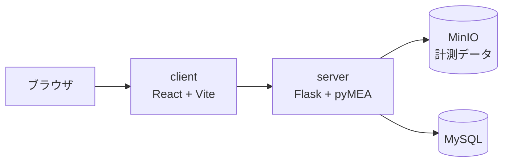

MEAで計測したデータを、ブラウザ上で確認できるアプリ [mea-viewer](https://github.com/kkito0726/mea-viewer) を作りました。

これまで、計測したデータを見るには**研究室のMEA装置の前まで行く必要がありました**。装置に付属したソフトでしか波形を開けなかったからです。データを見返したいと思っても、そのためだけに研究室へ足を運ぶことになります。

MEA Viewerを使えば、手元のPCのブラウザで同じデータを開けます。自宅でも、移動中でも、装置の空き状況を気にせず確認できます。

この記事では、そのアプリの構成と、**導入をできるだけ軽くするための工夫**を紹介します。

## 何が不便だったか

MEA（多電極アレイ）は、培養した心筋細胞や神経細胞の電気活動を多数の電極で同時に記録する装置です。詳しくは[前回の記事](../pymea-mea-analysis/)で触れました。

問題は、計測が終わったあとです。

- データを見られるのは装置に付属したソフトだけ
- そのソフトは計測装置に紐づいたPCにしか入っていない
- つまり**データを見たいときは必ず研究室へ行く**

計測そのものは装置がないとできないので仕方ありません。しかし「あのときの波形をもう一度見たい」という確認作業まで場所に縛られるのは、研究の進め方として不便でした。

## 何ができるようになったか

計測データをアップロードすると、ブラウザ上で図を生成して表示します。生成できる図は15種類あります。

| 種類 | 内容 |
| --- | --- |
| `showAll` | 64電極すべての波形を一覧表示 |
| `showSingle` | 単一電極の波形 |
| `showDetection` | ピーク検出の結果 |
| `plotPeaks` | ピークのプロット |
| `rasterPlot` | ラスタープロット |
| `draw2d` / `draw3d` | 2D / 3Dカラーマップ |
| `drawLine` | ラインプロット |

さらに、`plotPeaks` を除く7種類には**GIF版**が用意されています（`showAllGif`、`draw2dGif` など）。静止画では追えない時間変化を、アニメーションとして確認できます。

## 構成

フロントエンドとバックエンドを分け、データの保管にオブジェクトストレージを使っています。



| 役割 | 使用技術 |
| --- | --- |
| フロントエンド | React + Vite + TypeScript + Tailwind CSS |
| バックエンド | Python + Flask |
| 解析エンジン | pyMEA |
| オブジェクトストレージ | MinIO |
| データベース | MySQL |

なお、このほかにGoで書いたバックエンドもありますが、この記事ではPython側に絞ります。

### 図の生成は非同期で待つ

図の生成には時間がかかります。特にGIFは何枚もの図を描いて繋ぐので、リクエストを投げてそのまま応答を待つ作りにすると、接続が切れる心配が出てきます。

そこで、生成の開始と結果の受け取りを分けています。

```python
# POST /draw  → ジョブIDを返して 202 を返す
# GET  /draw/stream/<job_id>  → 完了までSSEで待つ
```

`POST /draw` はジョブIDだけを返してすぐ終わり、実際の描画はバックグラウンドで進みます。クライアントは `GET /draw/stream/<job_id>` に繋いで、Server-Sent Events で完了を待ちます。サーバー側は1秒間隔でジョブの状態を確認し、終わり次第そのまま結果を流します。

### バックエンドの構成

サーバー側のディレクトリはこう分かれています。

```
server/
├── controller/    # エンドポイント
├── usecase/       # ユースケース
├── service/       # ビジネスロジック
├── repository/    # データアクセス
├── model/         # モデル
├── lib/
├── config/
└── enums/
```

pyMEA本体もレイヤーで分けているので、**同じ考え方でそろえています**。プロジェクトをまたいでも構造が同じだと、どこに何があるか迷わずに済みます。

## pyMEAをそのまま解析エンジンにする

図の生成そのものは、前回の記事で紹介した解析ライブラリ **pyMEA** が担っています。Webアプリのために解析ロジックを書き直してはいません。

```txt
pyMEA @ git+https://github.com/kkito0726/MEA_modules.git
```

`requirements.txt` からGitHubのリポジトリを直接参照しています。pyMEA側を更新すれば、こちらもビルドし直すだけで最新の解析が使えます。

解析の中身はライブラリに任せ、MEA Viewerは**それをブラウザから触れるようにする層**に徹しています。同じ処理を2か所に書くと、片方を直したときにもう片方がずれていきます。

## セットアップを軽くする

自宅で使えるようにするには、**導入が面倒だと意味がありません**。研究室のメンバーに使ってもらうものなので、環境構築でつまずくと結局誰も使わなくなります。

そこで、**Dockerイメージをあらかじめビルドして配布しています**。

```yaml
services:
  server:
    image: ghcr.io/kkito0726/mea-viewer-server:latest
  client:
    image: ghcr.io/kkito0726/mea-viewer-client:latest
```

`docker-compose.yml` はビルド済みイメージを GitHub Container Registry から取得するだけです。利用者の手元でビルドは走りません。**イメージを取ってくるだけなので、セットアップが速く済みます。**

導入は、Docker Desktopを入れたあとセットアップスクリプトを実行するだけです。

```bash
./mac-setup.sh   # Windowsは win-setup.sh
```

スクリプトはコンテナを起動し、シェルの設定にエイリアスを1行追加します。

```bash
alias mea-viewer="docker compose -f ~/Workspace/mea-viewer/docker-compose.yml up -d && open http://localhost:4173/"
```

以降は `mea-viewer` と打つだけで、コンテナが立ち上がってブラウザが開きます。

```bash
mea-viewer
```

## おわりに

MEA Viewerでやったことをまとめると、次のようになります。

- 装置に紐づいていた確認作業を、手元のブラウザへ移した
- 解析はpyMEAに任せ、アプリはブラウザから触れるようにする層に徹した
- ビルド済みイメージを配布し、セットアップを1コマンドに寄せた

計測は装置の前でしかできませんが、**そのあとの作業まで場所に縛られる必要はない**、というのが作りたかったことです。

ソースコードは [GitHub](https://github.com/kkito0726/mea-viewer) で公開しています。

最後まで読んでいただきありがとうございました！！
