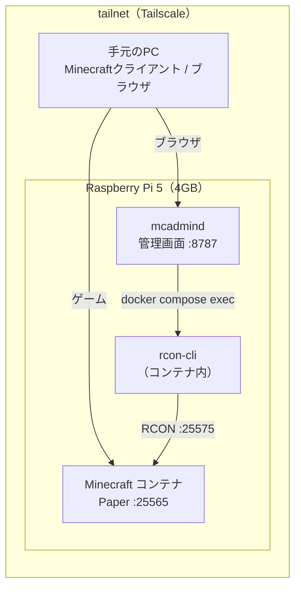
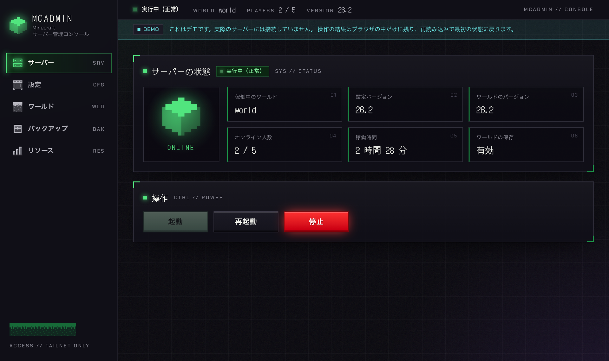
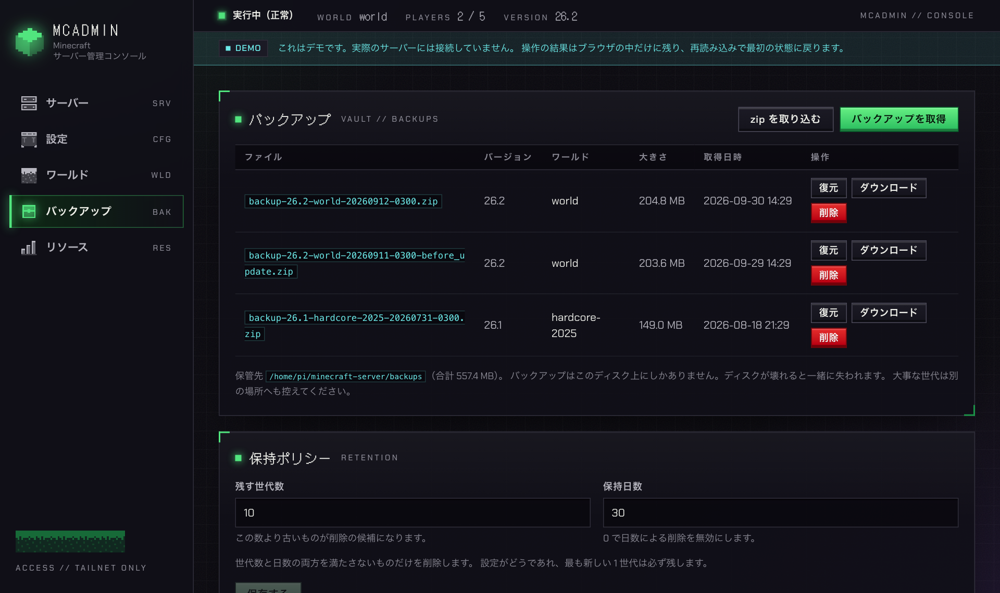
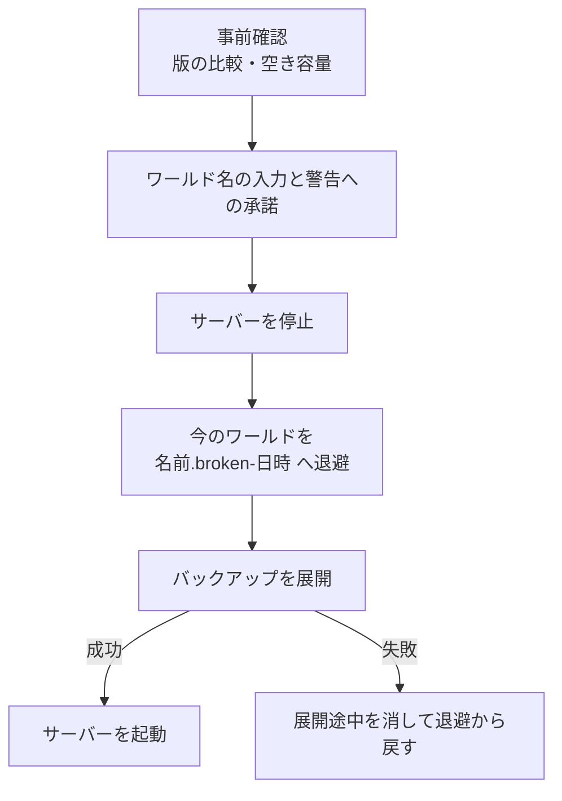
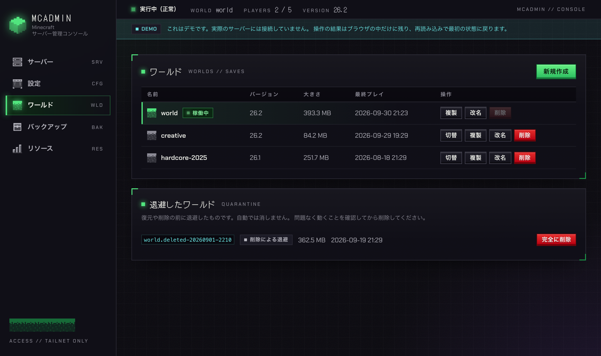

Raspberry Pi 5 の上で Minecraft サーバーを動かし、Tailscale 経由で遊べるようにしました。あわせて、バックアップ・復元・ワールドの切り替えをブラウザから行う管理画面を自作しました。

リポジトリは [kkito0726/minecraft-server](https://github.com/kkito0726/minecraft-server) です。

先に結論から。構成はこれだけです。

- サーバーは Docker Compose だけで動かす。Pi に Java は入れない
- 外からの接続は Tailscale に任せる。ルーターのポート開放はしない
- 日々の管理は、Pi に常駐させた管理画面（Go の単一バイナリ）からブラウザで行う

この記事では、Pi と Tailscale でどう組んだかと、管理画面で**危ない操作をどう安全にしたか**を紹介します。

## 全体の構成

登場するのは Pi 1台と、同じ tailnet（Tailscale のプライベートネットワーク）に参加した手元の端末だけです。



| 役割 | 使っているもの |
| --- | --- |
| Minecraftサーバー | Paper（[itzg/minecraft-server](https://github.com/itzg/docker-minecraft-server) イメージ。linux/arm64 対応） |
| 実行環境 | Docker Compose |
| 接続経路 | Tailscale |
| 管理画面のバックエンド | Go + Connect RPC |
| 管理画面のフロントエンド | React + TypeScript + Tailwind CSS |

### Tailscale でポートを開けずに外から入る

一番良かったのはここです。**自宅の LAN の外からでも、そのまま接続できます。**

Tailscale に参加した端末どうしは、どこにいても `100.x.y.z` のアドレスでつながります。Pi 側で `tailscale up` して、手元の PC も同じ tailnet に参加させれば、Minecraft クライアントのサーバーアドレスに Pi のホスト名を入れるだけで入れます。

```bash
# Pi 側
curl -fsSL https://tailscale.com/install.sh | sh
sudo tailscale up
tailscale ip -4      # 100.x.y.z
tailscale status     # MagicDNS のホスト名も出る
```

`compose.yaml` は 25565 を `0.0.0.0` で待ち受けているので、Tailscale のインターフェース（`tailscale0`）側にもそのまま届きます。追加の設定は要りません。

ルーターのポートは開けていません。tailnet に参加していない端末からは、そもそも到達できません。

### 守りは二段構え

「tailnet の中なら安全」とは考えていません。tailnet に招待した相手は全員 25565 に到達できるからです。そこで、到達の制御とは別に、もう一段の制御を置いています。

| 対象 | 1段目（到達） | 2段目（認可） |
| --- | --- | --- |
| ゲーム（25565） | Tailscale | ホワイトリスト（`MC_WHITELIST`） |
| 管理画面（8787） | Tailscale | 共有トークン（`ADMIN_TOKEN`、32文字以上でないと起動しない） |

もう一つ、RCON（サーバーのコンソールをネットワーク越しに叩くプロトコル）のポート 25575 は**外に出していません**。RCON は平文で、総当たりへの保護もないためです。コマンドを送るときは、コンテナの中にある `rcon-cli` を `docker compose exec` で呼びます。通信がホストの中で完結するので、平文であることが問題になりません。管理画面もこの経路を使っています。

## Pi 5（4GB）に合わせた設定

使っているのは Pi 5 の 4GB モデルで、`.env` の既定値もこれを前提に決めています。メモリの予算が一番厳しいので、そこから逆算しています。

| 設定 | 値 | 理由 |
| --- | --- | --- |
| `MC_MEMORY` | `2G` | JVM のヒープ。実際のメモリ使用量はヒープの 1.3〜1.4 倍が目安なので、OS の分を残すとこれが上限 |
| `MC_MEM_LIMIT` | `3g` | コンテナのメモリ上限。スワップに落ちて数秒固まるより、落として自動再起動させるほうが被害が小さい |
| `MC_AIKAR_FLAGS` | `FALSE` | よく推奨される Aikar のGCフラグは大きなヒープ向けで、2G ではかえって GC の頻度を上げる |
| `MC_VIEW_DISTANCE` | `7` | 描画距離。CPU と帯域の両方に効く |
| `MC_SIMULATION_DISTANCE` | `5` | エンティティやレッドストーンの処理範囲。描画距離より重いので小さく |
| `MC_MAX_PLAYERS` | `5` | 2G ヒープで現実的な人数 |

`compose.yaml` 側にも、Pi で常時動かすための設定を入れています。

- `stop_grace_period: 60s` — `docker stop` の既定の猶予は10秒で、ワールドの保存が間に合わないことがある
- ログの上限（10MB × 3） — Docker のログは既定で無制限なので、ストレージを食い潰さないように
- `restart: unless-stopped` — Pi の再起動後や OOM kill 後に自動で戻す

また、`MC_VERSION=LATEST` は意図的に使っていません。コンテナを作り直したタイミングで勝手に版が上がると、ワールドが片道でアップグレードされ、クライアントとも食い違うからです。

## 管理画面を作った理由

管理画面（`mcadmind`）でやりたかったのは、次の2つです。

- **ワールドを zip でバックアップし、ブラウザから手元の PC にダウンロードする**
- **複数のワールドを持っておき、画面から自由に入れ替える**

どちらもコマンドを打てばできます。ただ、そのたびに Pi へ SSH で入り、手順どおりに打つのは手間ですし、打ち間違えるとワールドを壊しかねません。ボタンひとつで済むようにしました。



| 画面 | できること |
| --- | --- |
| サーバー | 状態表示、起動・停止・再起動 |
| 設定 | ゲームモード・難易度・MOTD・最大人数・描画距離などの変更 |
| ワールド | 一覧・新規作成・複製・改名・削除・切り替え |
| バックアップ | 取得・一覧・削除・保持ポリシー・復元、zip の取り込みと手元の PC への保存 |
| リソース | Pi 本体の CPU・メモリ・ストレージの使用状況 |

逆に、RCON のコンソールやプレイヤー管理、`.env` の自由な編集は画面に置いていません。版やメモリを画面のひと押しで変えられると、ワールドの片道アップグレードや Pi が固まる状態を簡単に起こせてしまうためです。

## 危ない操作を安全にする

管理画面で扱う操作の多くは、間違えるとワールドを失います。作るうえで一番気を使ったのはここです。

### バックアップ：save-on を必ず戻す

ワールドのデータは `./data` をコンテナにマウントしているので、コンテナやサーバーが落ちても、ディスクに書かれたファイルは残ります。バックアップはこのディレクトリを zip に固めて作ります。

既定は「稼働したまま取る」方式です。稼働中はサーバーがファイルを書き換え続けるので、そのまま固めると書き込み途中のファイルを拾うおそれがあります。そこで `save-off` でディスクへの書き込みを止め、`save-all` で書き出してから zip に固め、最後に `save-on` で戻します。

気をつけたいのは `save-on` の戻し忘れです。`save-off` のままだと、以降の変更はメモリにだけたまってディスクに書かれません。その状態でプロセスが異常終了すると（OOM kill や停電など）、最後に保存した時点より後の進行が失われます。まだディスクにないデータなので、マウントしていても守れません。

厄介なのは、バックアップの途中でプロセスが kill されたり Pi が落ちたりした場合です。RCON には「いま保存が有効か」を問い合わせる手段がありません。そこで、**管理画面の起動時と、コンテナが healthy になるたびに `save-on` を無条件で送り直す**ようにしています。前回の操作が途中で終わった可能性があるときは、画面に赤い帯で知らせます。



一覧の下には「バックアップはこのディスク上にしかありません」と常に表示しています。同じ SSD に置いているだけでは、ディスクが壊れれば本体ごと消えるからです。大事な世代は「ダウンロード」から手元の PC に保存できます。

### 操作は同時に1つだけ、取り消しはできない

バックアップ・復元・ワールドの切り替えは、どれも `data/` を書き換えます。同時に走ると壊れるので、**操作は同時に1つだけ**にしています。

また、**操作の取り消しはできません。** たとえば復元を途中で止めると「元のワールドは退避済み、新しいワールドは展開途中」という最も悪い状態になります。止められる口を用意しないほうが安全だと判断しました。

その代わり、画面を閉じても操作は止まりません。開き直せば進捗とログが戻ってきます。

### 復元：退避してから展開する

復元は次の順で進みます。



大事なのは**展開より先に退避する**順序です。今のワールドに上書きで展開すると、古い地形と新しい地形が同居した壊れたワールドになります。退避したワールドは自動では消さず、画面の「退避したワールド」に残ります。

版の比較には、ワールドの `level.dat` に入っている `DataVersion`（整数）を使います。`26.2` のような表示用の文字列では中身の違いを見分けられないからです。バックアップのほうが古ければ「開くと版が上がる（戻せない）」、新しければ「今の版では開けない」と、復元する前に警告します。

### ワールドの切り替え：サーバーの版を合わせる



ワールドは `data/<名前>/` に複数置けて、`.env` の `MC_LEVEL` で稼働させるものを選びます。itzg イメージの `LEVEL` 変数を使った仕組みで、切り替え前のワールドは1バイトも動かないので、いつでも戻せます。

ただし、切り替えだけではワールドの版の問題が残ります。古い版で作ったワールドを今の版で開くと勝手に版が上がり、新しい版のワールドは古いサーバーでは起動しません。そこで、切り替えのたびに切り替え先の `level.dat` から版を読み、`.env` の `MC_VERSION` を合わせるようにしました。版が変わるときはログに警告を出すので、遊ぶ側はクライアントの版を合わせます。

## 管理画面の置き方

### コンテナにせず、Pi に直接常駐させる

管理画面は `docker compose` を叩くうえに、`data/` や `.env` も直接読み書きします。コンテナに入れると、ホストとコンテナでパスが食い違い、変換の仕組みが必要になります。

そこで、Go の静的バイナリを Pi に置き、systemd で常駐させています。フロントエンドもバイナリに埋め込んでいるので、置くファイルは1つです。

なお、権限の面ではどちらの方式でも大差ありません。Docker を操作できる時点で、コンテナに `docker.sock` を渡しても、ホストで docker グループに入れても、実質はホストの root 相当になります。守りの本体は Tailscale とトークンの二段構えで、管理画面を tailnet の外に出さないのはこのためです。

バイナリは、タグを打つと GitHub Actions が Release に添付します。Pi 側では落として登録するだけなので、**Pi に Go も Node.js も要りません**。

```bash
cd ~/minecraft-server
./deploy/download.sh      # この機械に合う版を選び、SHA256SUMS で検証して置く
sudo deploy/install.sh --project-dir ~/minecraft-server
```

更新も同じ2つのコマンドです。

### ポート番号なしの HTTPS で開く

管理画面はそのままだと `http://<ホスト名>:8787` で開きます。Pi の上で `tailscale serve` を挟むと、ポート番号なしの HTTPS で開けるようになります。

```bash
sudo tailscale serve --bg 8787
```

URL は `https://<ホスト名>.<tailnet 名>.ts.net` になり、証明書は Tailscale が管理します（tailnet の管理画面で MagicDNS と HTTPS 証明書を有効にしておく必要があります）。ポート番号が消えるうえ、管理画面側の待ち受けを `127.0.0.1:8787` に絞れるので、家庭内 LAN から平文の HTTP で開ける口を閉じられます。

### バックエンドなしで触れるデモ

画面は [GitHub Pages のデモ](https://kkito0726.github.io/minecraft-server/) で実際に触れます。上のスクリーンショットもこのデモのものです。

デモはバックエンドに一切接続しません。通信の口だけを差し替えていて、本物は `createConnectTransport` で `/rpc` に繋ぎ、デモは `createRouterTransport` でサービスの実装をブラウザの中で動かします。画面のコードには手を入れていないので、進捗の配信や再読み込みの動きまで本物と同じ経路を通ります。

## 省電力で常時起動できる

Pi にしてよかったのは、**省電力なので気兼ねなく常時起動しておける**ことです。

いまは Minecraft サーバーだけでなく、他の自作アプリもこの Pi の上で `docker compose` で動かしています。「とりあえず動かしておく場所」が1つあると、個人開発のアプリを気軽に常駐させられます。

## 残っている課題

- **バックアップは同じディスクにしかない** — 手元の PC への保存はできるようにしましたが、別の場所への自動転送はまだありません。大事な世代は手でダウンロードして控える必要があります
- **メモリの余裕が少ない** — 4GB のうち大半を Minecraft が使います。zip の作成・展開は小さなバッファで流すようにしていますが、バックアップ中にサーバーが重くなるのは避けられないので、人がいない時間帯に取るのが無難です
- **家庭内 LAN からも管理画面に届く** — 待ち受けの既定は `0.0.0.0:8787` なので、tailnet だけでなく同じ LAN の端末からも届きます。LAN 側を守っているのはトークンだけです。閉じたい場合は `tailscale serve` を使ったうえで `127.0.0.1:8787` に絞ります

## おわりに

- Tailscale を使えば、ポートを開けずに自宅の外からサーバーに入れる
- 到達の制御（Tailscale）と認可（ホワイトリスト・トークン）は別の層として両方置く
- 管理画面から、ワールドの zip バックアップのダウンロードと、複数ワールドの入れ替えができる
- 復元は「退避してから展開」、切り替えは「版を合わせる」で、ワールドを失う操作を減らした

どれも、自宅の小さなサーバーを**気軽に、壊さずに**動かし続けるための工夫です。

リポジトリは [kkito0726/minecraft-server](https://github.com/kkito0726/minecraft-server)、画面は [デモ](https://kkito0726.github.io/minecraft-server/) で触れます。Pi が1台余っていたら、ぜひ試してみてください。
