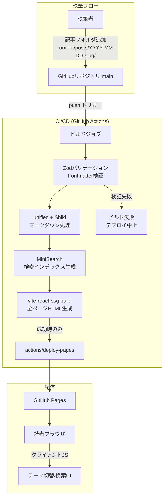

# 個人テックブログ アーキテクチャ設計

**作成日**: 2026-07-14
**関連要件定義**: [requirements.md](../../spec/personal-tech-blog/requirements.md)
**ヒアリング記録**: [design-interview.md](design-interview.md)

**【信頼性レベル凡例】**:
- 🔵 **青信号**: EARS要件定義書・設計文書・ユーザヒアリングを参考にした確実な設計
- 🟡 **黄信号**: EARS要件定義書・設計文書・ユーザヒアリングから妥当な推測による設計
- 🔴 **赤信号**: EARS要件定義書・設計文書・ユーザヒアリングにない推測による設計

---

## システム概要 🔵

**信頼性**: 🔵 *要件定義書概要・REQ-001〜012より*

マークダウン（1記事1フォルダのコロケーション方式）で執筆した記事を、ビルド時にすべて静的HTML化（SSG）し、GitHub Actions経由でGitHub Pagesに自動デプロイする個人テックブログ。サーバー・データベースを持たない完全静的構成であり、実行時のAPIは存在しない（そのためDBスキーマ・API仕様書は本設計の対象外）。

## アーキテクチャパターン 🔵

**信頼性**: 🔵 *ヒアリングQ2（SSG手法）・要件REQ-008より*

- **パターン**: ビルド時コンテンツ処理型のSSG（Static Site Generation）+ クライアントサイドの限定的なインタラクション（テーマ切替・検索）
- **SSG実現方式**: **vite-react-ssg**（React RouterベースのSSGライブラリ）
- **選択理由**:
  - Vite + React + TypeScriptというユーザー指定スタックにそのまま載る
  - ルート定義から全記事ページを一括プリレンダリングでき、OGP・SEOメタタグの静的埋め込み（REQ-007）が実現できる
  - vike・自作プリレンダーと比較して設定量と保守コストが最小（ヒアリングQ2で確定）

## コンポーネント構成

### フロントエンド 🔵

**信頼性**: 🔵 *ユーザー依頼（技術スタック指定）・ヒアリングQ2より*

- **フレームワーク**: React 18+ / TypeScript（strict）
- **ビルド**: Vite + vite-react-ssg
- **ルーティング**: React Router（vite-react-ssgが内包）。ルート: `/`（一覧）、`/posts/:slug/`（記事詳細）、`*`（404）
- **スタイリング**: TailwindCSS（ダークモードは `class` 戦略）
- **状態管理**: React Context + カスタムフック（テーマ・検索のみ。グローバル状態が小さいためRedux等は不採用） 🟡 *機能規模からの妥当な推測*
- **コンポーネント設計**: Atomicデザイン（atoms / molecules / organisms / templates / pages）

### コンテンツパイプライン（ビルド時） 🔵

**信頼性**: 🔵 *REQ-001〜012・ヒアリングQ3より（プラグイン構成の詳細は🟡）*

| 処理 | 採用技術 | 信頼性 |
|------|---------|--------|
| 記事ファイル収集 | `import.meta.glob('/content/posts/*/index.md')` | 🟡 実装方式の妥当な推測 |
| frontmatterパース | gray-matter | 🟡 デファクトからの妥当な推測 |
| frontmatterバリデーション | Zod（title/date必須。違反時ビルドエラー: REQ-104） | 🔵 グローバルルール+要件より |
| マークダウン→HTML | unified（remark-parse → remark-gfm → remark-rehype → rehype-stringify） | 🟡 デファクトからの妥当な推測 |
| シンタックスハイライト | **Shiki**（@shikijs/rehype、ビルド時に色付け済みHTML生成） | 🔵 ヒアリングQ3より |
| 見出しID付与・TOC抽出 | rehype-slug + 独自TOC抽出（h2/h3） | 🔵 REQ-006より |
| 相対パス画像の解決 | 独自rehypeプラグイン + Viteアセットパイプライン（欠落時はビルドエラー） | 🔵 REQ-011・ヒアリングQ5より |
| 検索インデックス生成 | **MiniSearch**（ビルド時にJSON生成、bigramトークナイザーで日本語対応） | 🔵 ヒアリングQ4より（Phase 2） |

### データベース・バックエンド

**なし**（完全静的サイトのため不要） 🔵 *REQ-008・アーキテクチャ方針より*

## システム構成図



**信頼性**: 🔵 *要件定義REQ-101/105・ヒアリング結果より*

## ディレクトリ構造 🟡

**信頼性**: 🟡 *Atomicデザイン指定（🔵）+ 一般的なVite構成からの妥当な推測*

```
./
├── .github/
│   └── workflows/
│       └── deploy.yml          # ビルド&デプロイワークフロー
├── content/
│   └── posts/                  # 記事（1記事1フォルダ: REQ-001）
│       └── YYYY-MM-DD-<slug>/
│           ├── index.md
│           └── *.png
├── src/
│   ├── components/
│   │   ├── atoms/              # 例: Heading, DateLabel, Spinner
│   │   ├── molecules/          # 例: PostCard, SearchBox, ThemeToggle
│   │   ├── organisms/          # 例: Header, PostList, TableOfContents, ArticleBody
│   │   └── templates/          # 例: BlogLayout
│   ├── pages/                  # ルート単位のページ（Atomicのpages層）
│   │   ├── HomePage.tsx
│   │   ├── PostPage.tsx
│   │   └── NotFoundPage.tsx
│   ├── lib/                    # コンテンツパイプライン
│   │   ├── posts/              # 収集・frontmatterバリデーション・ソート
│   │   ├── markdown/           # unified変換・TOC抽出・画像パス解決
│   │   └── search/             # MiniSearchインデックス生成・検索
│   ├── hooks/                  # useTheme, useSearch 等
│   ├── types/                  # 型定義（interfaces.ts参照）
│   ├── routes.tsx              # vite-react-ssgルート定義
│   └── main.tsx
├── tests/                      # 単体・統合テスト（Vitest）
├── e2e/                        # E2Eテスト（Playwright）
└── docs/                       # 要件定義・設計文書
```

## 非機能要件の実現方法

### パフォーマンス 🔵

**信頼性**: 🔵 *NFR-001〜003・ヒアリングQ5（Lighthouse 90+確定）より*

- **LCP 2.5秒以内 / Lighthouse Performance 90以上**: 全ページ静的HTML配信、ハイライトはビルド時実施（クライアントJS最小化）
- **検索1秒以内**: ビルド時生成のMiniSearchインデックスをクライアントで遅延ロード（検索UI初回操作時にfetch） 🟡 *ロード戦略は妥当な推測*
- **画像**: Viteアセットパイプラインでハッシュ付きファイル名化（長期キャッシュ可能）

### セキュリティ 🔵

**信頼性**: 🔵 *NFR-101〜103より*

- **XSS対策**: マークダウン処理で生HTMLをデフォルト無効（remark-rehypeの既定動作）。生HTML許可が必要になった場合はrehype-sanitizeを併用
- **シークレット管理**: 完全静的サイトのためシークレット不要。ワークフローは `GITHUB_TOKEN` のみ使用
- **Actions権限最小化**: `permissions: contents: read / pages: write / id-token: write` に限定

### スケーラビリティ 🟡

**信頼性**: 🟡 *個人ブログの規模からの妥当な推測*

- 記事数百件規模まで現構成で対応可能（全記事ビルドでもVite処理は数十秒以内）
- 記事数増加でビルドが遅くなった場合の拡張余地: 検索インデックスの分割、一覧のページネーション追加

### 可用性 🟡

**信頼性**: 🟡 *GitHub Pages仕様からの妥当な推測*

- 配信はGitHub PagesのSLAに依存（個人ブログとして十分）
- ビルド失敗時は直前のデプロイが維持される（REQ-105により壊れたサイトは公開されない）

## 技術的制約

### GitHub Pages制約 🔵

**信頼性**: 🔵 *REQ-403/405・GitHub Pages仕様より*

- サブパス配信（`https://kkito0726.github.io/tech-blog-kkito/`）のため、Viteの `base: '/tech-blog-kkito/'` 設定が必須
- SPAフォールバックが無いため、404は `404.html` の静的生成で対応（vite-react-ssgのルートから生成）

### コーディング制約 🔵

**信頼性**: 🔵 *ユーザーのグローバルルールより*

- イミュータブルなデータ操作（記事ソート等も新配列を返す）
- 1ファイル200〜400行目安（最大800行）、Atomicデザイン階層厳守
- TDD・テストカバレッジ80%以上（Vitest + React Testing Library + Playwright） 🟡 *テストツールは妥当な推測*

## 関連文書

- **データフロー**: [dataflow.md](dataflow.md)
- **型定義**: [interfaces.ts](interfaces.ts)
- **設計ヒアリング記録**: [design-interview.md](design-interview.md)
- **要件定義**: [requirements.md](../../spec/personal-tech-blog/requirements.md)

※ 完全静的サイトのため database-schema.sql / api-endpoints.md は作成しない（実行時DB・APIが存在しない）。

## 信頼性レベルサマリー

- 🔵 青信号: 21件（66%）
- 🟡 黄信号: 11件（34%）
- 🔴 赤信号: 0件（0%）

**品質評価**: 高品質
