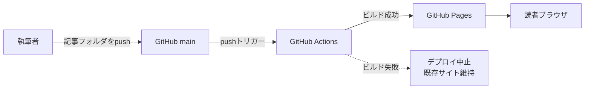
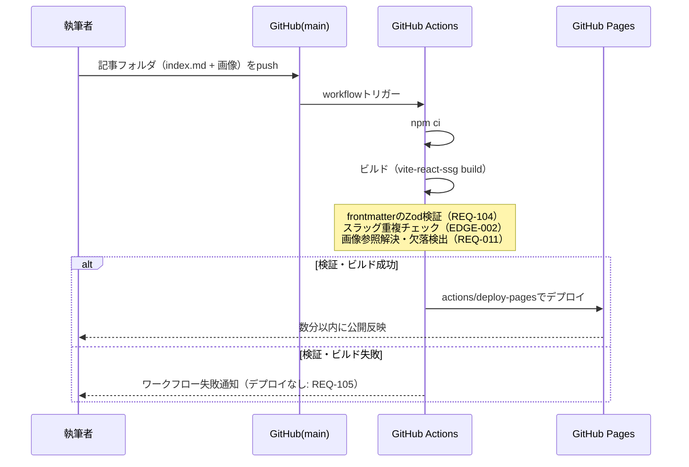
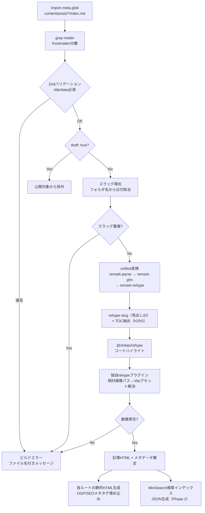
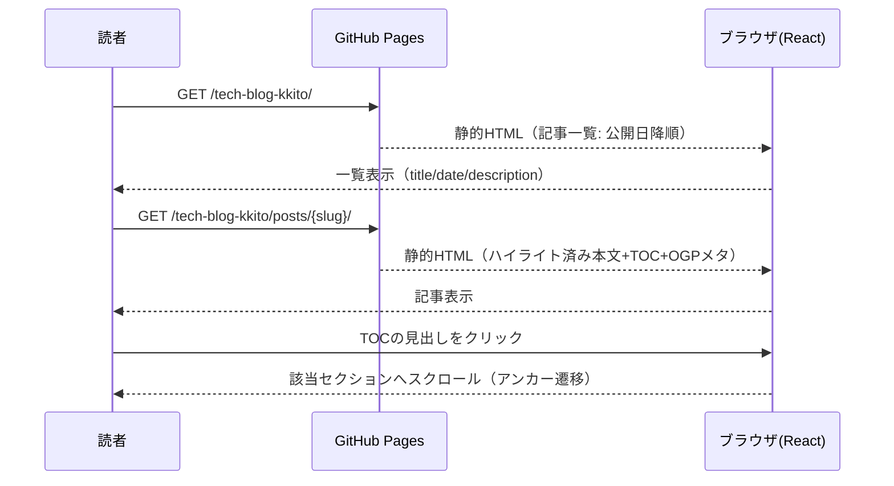
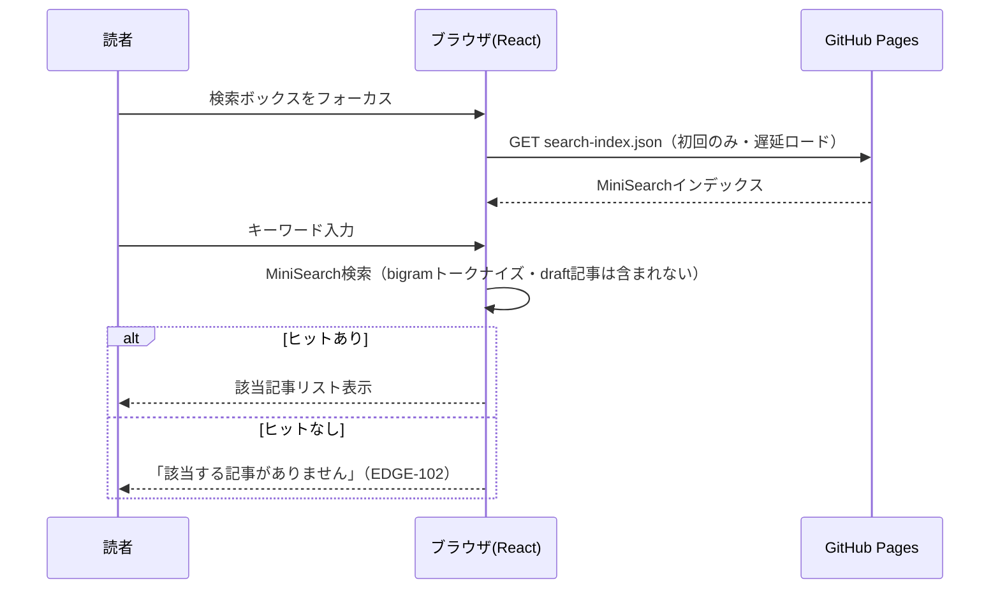
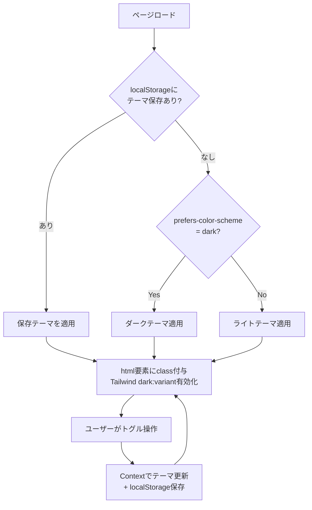
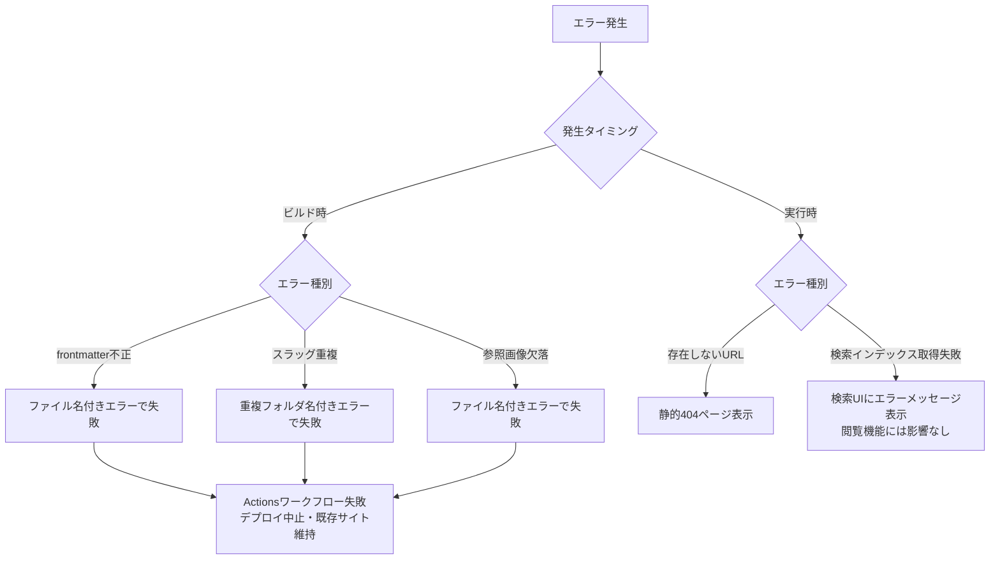

# 個人テックブログ データフロー図

**作成日**: 2026-07-14
**関連アーキテクチャ**: [architecture.md](architecture.md)
**関連要件定義**: [requirements.md](../../spec/personal-tech-blog/requirements.md)

**【信頼性レベル凡例】**:
- 🔵 **青信号**: EARS要件定義書・設計文書・ユーザヒアリングを参考にした確実なフロー
- 🟡 **黄信号**: EARS要件定義書・設計文書・ユーザヒアリングから妥当な推測によるフロー
- 🔴 **赤信号**: EARS要件定義書・設計文書・ユーザヒアリングにない推測によるフロー

---

## システム全体のデータフロー 🔵

**信頼性**: 🔵 *要件定義・ユーザーストーリー1.2より*

## 主要機能のデータフロー

### 機能1: 記事の自動公開（Phase 1） 🔵

**信頼性**: 🔵 *REQ-101/104/105・受け入れ基準TC-101より*

**関連要件**: REQ-101, REQ-104, REQ-105

**詳細ステップ**:
1. 執筆者が `content/posts/YYYY-MM-DD-<slug>/index.md`（+画像）をmainにpush
2. GitHub Actionsがビルドを開始し、Zodでfrontmatter（title/date必須）を検証
3. `draft: true` の記事を除外（REQ-102）した上で全ページを静的生成
4. 成功時のみGitHub Pagesへデプロイ

### 機能2: ビルド時コンテンツ処理パイプライン（Phase 1） 🔵

**信頼性**: 🔵 *REQ-004〜007/011・ヒアリングQ3より（内部順序は🟡）*

**関連要件**: REQ-004, REQ-005, REQ-006, REQ-007, REQ-011, REQ-012

### 機能3: 記事閲覧（Phase 1） 🔵

**信頼性**: 🔵 *ユーザーストーリー2.1/2.2・REQ-003〜006より*

**関連要件**: REQ-003, REQ-004, REQ-005, REQ-006, REQ-012

### 機能4: 記事検索（Phase 2） 🔵

**信頼性**: 🔵 *REQ-009・ヒアリングQ4より（遅延ロード戦略は🟡）*

**関連要件**: REQ-009, REQ-301

### 機能5: テーマ切替（Phase 2） 🔵

**信頼性**: 🔵 *REQ-010/201/202より（実装方式は🟡）*

**関連要件**: REQ-010, REQ-201, REQ-202

**備考**: FOUC（テーマちらつき）防止のため、テーマ判定スクリプトを`<head>`内にインラインで埋め込む 🟡 *SSGサイトの定石からの妥当な推測*

## データ処理パターン

### ビルド時処理（同期） 🔵

**信頼性**: 🔵 *アーキテクチャ設計より*

記事の収集・検証・変換・インデックス生成はすべてビルド時に完結する。実行時のデータ取得は検索インデックスJSONのfetchのみ。

### クライアント処理 🟡

**信頼性**: 🟡 *機能要件からの妥当な推測*

テーマ切替と検索のみクライアントJSで動作。それ以外は静的HTMLで完結し、ハイドレーション後もデータ通信は発生しない。

## エラーハンドリングフロー 🔵

**信頼性**: 🔵 *REQ-103〜105・EDGE-001/002・ヒアリングQ5より*

**信頼性**: 検索インデックス取得失敗時の挙動のみ 🟡 *妥当な推測*

## 関連文書

- **アーキテクチャ**: [architecture.md](architecture.md)
- **型定義**: [interfaces.ts](interfaces.ts)
- **要件定義**: [requirements.md](../../spec/personal-tech-blog/requirements.md)

## 信頼性レベルサマリー

- 🔵 青信号: 8件（67%)
- 🟡 黄信号: 4件（33%)
- 🔴 赤信号: 0件（0%)

**品質評価**: 高品質
